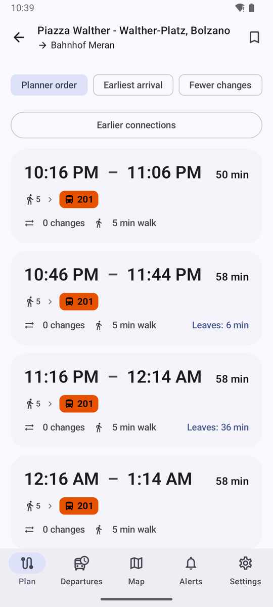
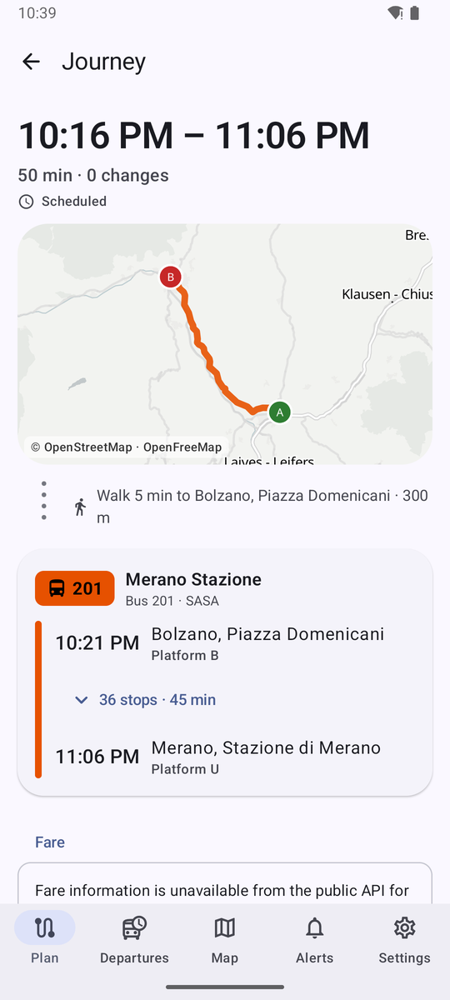
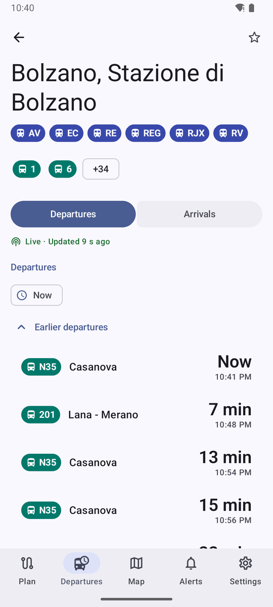
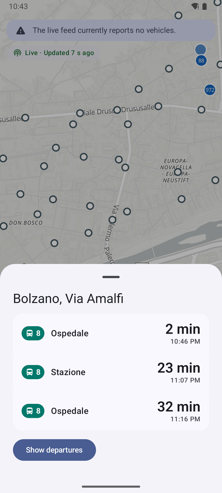
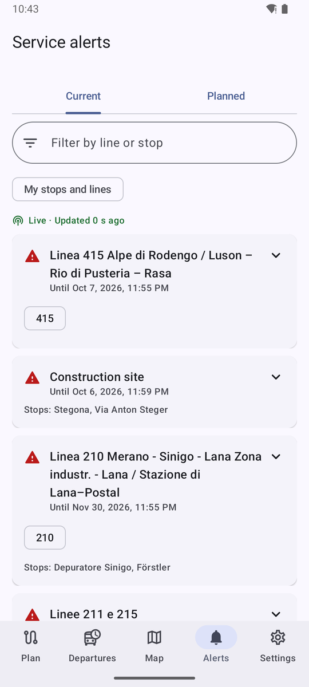
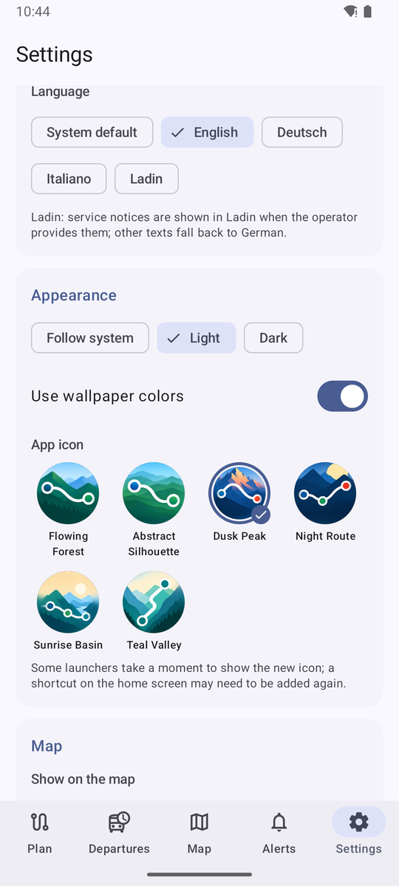
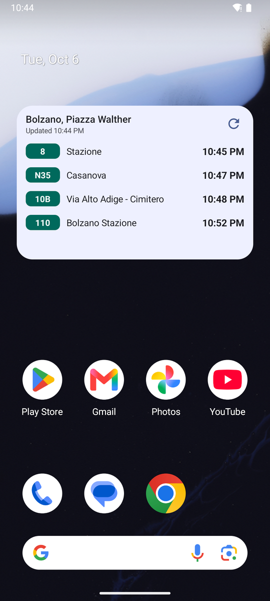

<p align="center"></p>

# South Tyrol Transit

> **This app is vibe coded.** It was written almost entirely by AI coding assistants (first ChatGPT, then Claude) from a
> plain-language brief, with a human steering, testing on devices and reviewing the result. Treat it as a hobby project:
> it works and has tests, but read the code before you rely on it.

Unofficial Android app for public transport in South Tyrol / Alto Adige. Released into the public domain under
[The Unlicense](LICENSE): do whatever you want with it.

## Screenshots

<table>
  <tr>
    <td align="center"><br><sub>Journey results</sub></td>
    <td align="center"><br><sub>Journey detail</sub></td>
    <td align="center"><br><sub>Live departure board</sub></td>
  </tr>
  <tr>
    <td align="center"><br><sub>Map with stop preview</sub></td>
    <td align="center"><br><sub>Service alerts</sub></td>
    <td align="center"><br><sub>Settings and app icons</sub></td>
  </tr>
  <tr>
    <td align="center"><br><sub>Home-screen widget</sub></td>
    <td></td>
    <td></td>
  </tr>
</table>

## 1. Purpose

South Tyrol Transit is a native Android app for public transport in South Tyrol / Alto Adige. It covers journey planning, live departures, line and stop information, live vehicles, service alerts and saved items.

It is built only on legitimate open data:

- STA timetables and GTFS-Realtime via Open Data Hub
- the public STA EFA journey planner
- Open Data Hub mobility data
- OpenStreetMap-based maps

"South Tyrol Transit" and the package id `org.southtyrol.transit` are **placeholders**; rename them in `app/build.gradle.kts` and `strings.xml`. The launcher icons come from the PNGs in `icons/` (default: Flowing Forest; users pick one in Settings → Appearance). Run `python tools/generate_icons.py` after adding or changing one: it fills the black corners, centres the art so the route stays inside the circular mask, and writes the adaptive-icon layers, previews and launcher aliases' icons. `res/drawable/ic_launcher_monochrome.xml` is the themed-icon silhouette.

## 2. Unofficial status

This app is **independent and unofficial**. It is not affiliated with STA, SASA, südtirolmobil / altoadigemobilità or the Province. It uses no official logos, artwork or branding, and says so on the About screen.

## 3. Screens and features

| Area | What it does |
|---|---|
| **Plan** (home) | Connected From/To hero with a swap button. Place search (stops, addresses, POIs) in a bottom sheet with "use my location", "pick on the map" (any point or a stop), Home/Work and recents. Leave now / depart at / arrive by with date-time pickers. Preferences: fastest, fewer changes, less walking. Mode filters, walking speed, wheelchair option. Saved and recent journeys. Tickets entry |
| **Results** | Journey cards with large dep/arr times, duration, changes, walking, a line chain, live/delay/cancel/notice pills and planner fares. Sorting, earlier/later. Save the journey. Two-pane list/detail on wide screens |
| **Journey detail** | Map of all legs (walking dashed) and a timeline. Transit legs show line, destination, operator, platforms, scheduled vs live times and expandable intermediate stops. Transfer times and leg notices. Fare section with honest labelling |
| **Departures** | Stop search, pick a stop on the map, nearby stops (location on demand), saved stops, entry to Lines. Two-pane stop list + live board on large screens |
| **Stop** | Live departures/arrivals with countdown hero, delay text, platform, cancellation and alert flags. Freshness line with "updated … ago". Pull to refresh. Served lines, platform map, distance, wheelchair info, favourite |
| **Trip** | One collapsed card above the timeline summarises this line's/run's service notices; tap it to expand every notice in full. Stop-by-stop timeline with scheduled/predicted times, skipped stops, next-stop highlight, live vehicle on the shape map with its age |
| **Lines** | Line search. Line page with directions, ordered stops, shape map, live vehicles, upcoming trips, alerts, operator, favourite |
| **Map** | MapLibre (OpenGL ES) map with clustered stops, live vehicles (bearing arrows, dimmed when stale, hidden after 10 min) and optional parking / bike / car-sharing layers. Saved stops highlighted. MapLibre logo/info button removed; a compact OSM/OpenFreeMap credit remains (ODbL). Only a "my position" button floats over the map; which layers are shown and where that button sits (or whether it is hidden) are chosen in Settings. Stop sheet with the next departures; vehicle sheet with line, destination, next stop, delay and freshness |
| **Alerts** | Current and planned alerts merged from GTFS-RT and EFA AddInfo, deduplicated. Filter by line or stop (text; tapping a line chip filters to it) and to my stops/lines. Multilingual (de/it/en/lld) with a language switcher. Validity periods. Stale marking offline |
| **Saved** (in Settings) | Places, stops, lines, journeys and recents; add stops (search or map) and lines. Saved stops and lines drive the Alerts "My stops and lines" filter and alert notifications. Local only |
| **Settings** (tab) | Grouped in cards; choices use Material filter chips. Saved items, start tab, map layers and "my position" button placement, language (system/en/de/it/Ladin), theme (system/light/dark), dynamic color, wheelchair default, opt-in alert notifications, offline timetable status/download/mobile-data/FTP-fallback |
| **Navigation** | Bottom tabs Plan / Departures / Map / Alerts / Settings. The tab stays selected inside its sub-views; tapping the current tab returns to its root. Sub-views slide in horizontally (Material shared-axis style) so predictive back animates them; tab switches and reduced-motion use a fade |
| **About / Tickets** | Unofficial disclaimer, data sources and licences, privacy. Explanation that tickets are sold by the official service, with a link |

## 4. Architecture overview

- Kotlin, Jetpack Compose (Material 3 Expressive), coroutines and Flow/StateFlow, ViewModel.
- Type-safe Navigation Compose, Hilt (KSP), Room, DataStore, WorkManager, OkHttp, kotlinx-serialization, GTFS-Realtime protobuf bindings, MapLibre.
- **Layers.** UI (screens + ViewModels) → repositories → data-source interfaces → implementations. ViewModels only see domain models (`core:model`) and never know whether data came from GTFS, GTFS-RT or EFA.
- **Interfaces** (`core/model/.../Interfaces.kt`):
  - `TransitScheduleDataSource` (GTFS)
  - `RealtimeTransitDataSource` (GTFS-RT)
  - `JourneyPlannerDataSource`, `GeocodingLocationDataSource`, `DepartureBoardDataSource`, `AlertDataSource` (EFA)
  - `MobilityDataSource` (ODH)
  - `TicketingProvider` (official link only)
  - `PushBackend` (no-op until a server exists)
- **Merging.** `DepartureRepository`, `TripRepository` and `AlertRepository` combine static schedule, realtime snapshot and alerts. `RealtimeMerge` implements GTFS-RT delay propagation, cancellation, skipped stops and staleness. `FreshnessPolicy` holds the explicit rules.
- **Live screens** poll through `PollWhileVisible` (`repeatOnLifecycle(STARTED)`), so nothing polls in the background. Per-feed throttling in `RealtimeRepository` prevents duplicate requests when several screens are open.
- **Map** is provider-agnostic: features use `TransitMap(MapContent…)`. MapLibre lives in one file (`MapLibreTransitMap.kt`). The project uses the OpenGL ES build (`org.maplibre.gl:android-sdk-opengl`): the default Vulkan build crashed the Android emulator's software GPU and is riskier on older devices at minSdk 26.

## 5. Modules

| Module | Contents |
|---|---|
| `core:model` | Pure Kotlin/JVM: domain models, GTFS time and calendar logic, realtime merge, freshness policy, multilingual fallback, alert dedupe, geo/polyline/contrast utilities, data-source interfaces |
| `core:data` | Android library: network (`TransitHttp`), CSV, GTFS importer and schedule store (Room, one DB file per feed version), GTFS queries, EFA client/parsers, GTFS-RT parser and repository, ODH mobility, repositories, DataStore settings |
| `core:designsystem` | Theme (`MaterialExpressiveTheme`, fallback palette, motion schemes), status colors, mode colors/shapes, components (line badges, countdown, delay/freshness labels, banners, expressive loading, empty/error states, connected toggle group), formatting |
| `core:map` | `TransitMap` API and MapLibre implementation |
| `app` | Application, DI, navigation, feature screens (`feature.*` packages), workers, location |

Features are packages inside `app` rather than modules. That keeps AGP configuration and build times small; splitting them out later is mechanical.

## 6. Public APIs and data sources

See **[docs/API_DISCOVERY.md](docs/API_DISCOVERY.md)** for endpoints, fields, refresh behaviour, error handling, confidence and what is deliberately not used. In summary:

- **Static GTFS**: `gtfs.api.opendatahub.com/v1/dataset/sta-time-tables/raw`, with a fallback to STA's own `ftp.sta.bz.it` publication point.
- **GTFS-Realtime**: `files.opendatahub.com/gtfs-rt/feeds/sta/*.pb`, the sources listed in ODH `datasets.yml`, with a fallback to `gtfs.api…/v1/realtime`.
- **STA EFA XML**: `efa.sta.bz.it/apb/`, covering StopFinder, Trip, DM, Coord and AddInfo.
- **ODH Mobility v2**: parking, bike sharing and car sharing.
- **OpenFreeMap** tiles: Positron for light mode, Dark for dark mode.

## 7. Data licensing

- STA timetable, realtime and EFA data: **CC0**. Credited anyway on the About screen.
- ODH Mobility: open data published by Open Data Hub.
- Map: OpenFreeMap tiles; data © OpenStreetMap contributors (**ODbL**). Attribution is shown in the map and on the About screen.
- App code: public domain via **[The Unlicense](LICENSE)**. Use, copy, modify, sell, relicense: no conditions, no attribution required. (The data licences above still apply to the data.)

## 8. Setup

Requirements:

- JDK 21. The Android Studio bundled JBR works.
- Android SDK with platform **android-37.1** and build-tools 37.

Steps:

1. Point `local.properties` at your SDK: `sdk.dir=...`.
2. Optionally add map style overrides:
   ```properties
   # local.properties (never commit secrets)
   map.styleUrl=https://example.org/style.json
   map.styleUrlDark=https://example.org/dark.json
   ```
   Environment variables `TRANSIT_MAP_STYLE_URL` and `TRANSIT_MAP_STYLE_URL_DARK` also work.

## 9. Map and API keys

**No keys are required.** All sources are keyless. If you switch to a keyed tile provider, put the full style URL (including the key) in `local.properties` or an environment variable. It is injected into `BuildConfig` and never committed: `local.properties` is git-ignored.

## 10. Build

```bash
./gradlew assembleDebug            # app/build/outputs/apk/debug/app-debug.apk
./gradlew assembleRelease          # R8-minified; configure signing first
./gradlew lintDebug                # Android Lint (abortOnError)
```

## 11. Tests

```bash
./gradlew :core:model:test :core:data:testDebugUnitTest :app:testDebugUnitTest
./gradlew :app:connectedDebugAndroidTest           # on a device/emulator
# Optional: import the real 150 MB STA feed and join it with captured realtime
./gradlew :core:data:testDebugUnitTest --tests '*RealFeedTest*' -PgtfsReal=/path/to/google_transit_shp.zip
```

- **Unit (`core:model`)**:
  - GTFS times beyond 24:00
  - calendar and calendar_dates logic
  - DST spring/fall
  - Europe/Rome independent of device zone
  - realtime delay, early running, propagation, NO_DATA, cancellation, skipped stops, staleness
  - vehicle freshness
  - multilingual fallback incl. Ladin
  - alert dedupe and validity
  - polyline, simplification, contrast
- **Unit (`core:data`)**:
  - CSV edge cases
  - EFA parsing of trip, walking, fares, DM, coord, AddInfo, StopFinder, error -8020, DTD rejection and malformed XML, using real captured fixtures
  - trip parameter building, including date/time in Europe/Rome
  - GTFS-RT trip updates, vehicles and multilingual alerts
  - mobility freshness
  - MockWebServer: retries, 404, 429 with Retry-After, 5xx, timeouts, disconnects, malformed and empty payloads
  - importer joins, past-midnight trips, calendar exceptions, translations, terminating trips, atomic swap and rejection of broken feeds (Robolectric)
  - network-board fallback, realtime/alert merge and stale handling, offline place search, cached alerts going stale offline, saved items
- **UI (Robolectric Compose, `app/src/test`)**: journey search and result selection, stop departures, saving a stop, alerts, offline state, location-permission-denied state.
- **Instrumented (`app/src/androidTest`)**: EFA parsers on the device's XML stack, plus a developer helper that imports a pushed GTFS zip:
  ```bash
  adb push google_transit_shp.zip /data/local/tmp/sta.zip
  adb shell am instrument -w -e feed /data/local/tmp/sta.zip -e class org.southtyrol.transit.ImportFeedOnDevice org.southtyrol.transit.test/androidx.test.runner.AndroidJUnitRunner
  ```

Fixtures live in `docs/fixtures`.

## 12. Static GTFS update strategy

1. **Schedule.** `ScheduleSyncWorker` (WorkManager) runs once after install and weekly afterwards, on unmetered network, battery not low and storage not low by default. The user can "Download now" over any network.
2. **Download.** Conditional (ETag / Last-Modified). If the HTTPS source fails and the setting allows it, the STA FTP mirror is used.
3. **Skip unchanged feeds.** If the SHA-256 is unchanged, nothing is imported.
4. **Import.** The feed is streamed into a **new SQLite file**:
   - Integer surrogate keys and indexes for stop, trip, station and stop-time lookups, plus an FTS4 stop-name index (all languages, accent-folded).
   - Shapes are simplified (Douglas–Peucker, 4 m) and stored as encoded polylines.
   - Headsign translation gaps are filled with a text dictionary.
5. **Validate.** The import checks required files, the timezone and referential integrity (more than 1 % broken stop_times is rejected).
6. **Activate.** An atomic pointer rename switches to the new file and old files are deleted. An interrupted or failed import never touches the working schedule.
7. **Real feed (4 Oct 2026):** 6,436 stops, 57,316 trips, 1.1 M stop_times. 15 s import on desktop (expect 1–3 min on a phone, shown as a foreground progress notification). 96 MB database. Departure board query about 60 ms.

## 13. Realtime update strategy

- Trip updates and vehicle positions are fetched as protobuf **only while a live screen is visible**: 30 s on boards and lines, 20 s on map and trips. They are throttled to at most every 20 s per feed across screens.
- Alerts are fetched at most every 2 min (GTFS-RT) and 10 min (EFA AddInfo), and cached on disk.
- Freshness rules (`FreshnessPolicy`):
  - Trip predictions older than 5 min are ignored.
  - A feed not fetched for 3 min counts as unavailable.
  - Vehicles are dimmed after 2 min and hidden after 10 min.
- Every live value shows its age. When data is stale the UI shows scheduled times and says so.

## 14. Offline behaviour

Available offline:

- downloaded timetable: stop and line search, nearby stops, departure boards (scheduled), trips, line pages
- route shapes
- saved items and recents
- the last alerts, marked **stale** with their age

Place search falls back to timetable stops. Journey planning needs the EFA service and says so; no offline router is claimed. Realtime is never shown as live from cache. Without a downloaded timetable, boards use the online EFA departure monitor and say so.

## 15. Localization

- UI in **English, German and Italian**, using Android resources only and per-app language selection (Android 13+ system UI; AppCompat storage on older versions).
- **Ladin:** selecting it uses the locale list `lld,de,it`, so the UI falls back to German. Ladin texts from the feeds (GTFS-RT alerts carry `lld`; EFA `ld1/ld2`) are shown.
- GTFS stop names and headsigns use German translations for de/lld and the Italian base names otherwise. EFA requests use the app language (StopFinder uses de/it; see API quirks).
- All clock times are shown in Europe/Rome.

## 16. Known API limitations

- **Date format pitfall (fixed).** EFA silently ignores `itdDate` values with a UTC offset. `DateTimeFormatter.BASIC_ISO_DATE` adds one for zoned values, so the app uses `yyyyMMdd`; a unit test covers this.

- `gtfs.api.opendatahub.com` returned **502** for all dataset/realtime paths on 4 Oct 2026. Hence the fallbacks.
- EFA StopFinder ignores `language=en` (it returns "not identified") and matches names per language. The app queries de and it in parallel and merges the results.
- GTFS has no route colours, `feed_info`, transfers or fares. Translations cover German only, and headsigns only partly.
- Realtime coverage is partial: about 57 trip updates and 135 vehicles at a time. Vehicles not matched to a trip show "trip unknown".
- Bike and car sharing data for South Tyrol on ODH is sparse or stale, so those layers are off by default.
- EFA `infoLinkURL`s point to an internal network address and are not opened.

## 17. Ticketing limitation

There is **no public API** to buy or validate tickets. The app never imitates tickets, QR codes or accounts. The Tickets screen explains this and links to official information. Fares are shown only when the EFA planner reports them, labelled as planner-reported. `TicketingProvider` is the integration point if a legitimate API appears.

## 18. Notification / backend limitation

Background notifications are an **opt-in periodic check (about 30 min, best effort)** using WorkManager, and the settings text says so. True realtime push requires a server; the contract is in **[docs/PUSH_BACKEND.md](docs/PUSH_BACKEND.md)** (`PushBackend` interface, no-op by default). No reference server is included.

## 19. Material 3 Expressive dependency status

- Expressive APIs (`MaterialExpressiveTheme`, `MotionScheme.expressive()`, `LoadingIndicator`/`ContainedLoadingIndicator`, `ToggleButton` connected groups, `SegmentedListItem`, `HorizontalFloatingToolbar`, `LargeFlexibleTopAppBar`, `MaterialShapes`, `LinearWavyProgressIndicator`, expressive `NavigationSuiteScaffold`/`NavigationSuiteItem`) exist only in the **prerelease** line.
- The project pins `androidx.compose.material3:material3:1.5.0-alpha29` and Compose `1.13.0-alpha01`, the version material3 is built against. Stable 1.4.0 lacks these APIs.
- Opt-ins are explicit per file (`@file:OptIn(ExperimentalMaterial3ExpressiveApi::class)`), and most usage is wrapped in `core:designsystem`.
- When animations are disabled system-wide, the theme switches to the standard motion scheme and static progress.

Toolchain: AGP 9.4.1, Kotlin 2.4.20, Gradle 9.8.0, compileSdk 37.1, targetSdk 37, minSdk 26.

## 20. Future improvements

- Offline routing (e.g. RAPTOR over the GTFS DB) and an offline place index.
- The FCM push backend from `PUSH_BACKEND.md`.
- Proper Ladin UI translations reviewed by native speakers.
- Accessibility pathways/levels if the feed adds them.
- Screenshot tests (Roborazzi) for key screens, and baseline profiles.
- Widgets and Wear OS tiles for saved stops.
- Better vehicle-to-trip matching when `trip_id` is missing (via block/route + position).
- Replace the EFA departure board with SIRI-ET if published officially.
- Line colour mapping (operator-provided) once available.

## In-app updates and publishing a release

The app updates itself from **GitHub Releases** of
[ta-samuelece/SouthTyrolTransit](https://github.com/ta-samuelece/SouthTyrolTransit):

- On start (switchable in Settings → App updates) and on "Check for updates", it asks
  `api.github.com/repos/<repo>/releases/latest`. Drafts and pre-releases are ignored.
- If the release tag (e.g. `v0.2.0`) is newer than the installed `versionName`, it offers the update with the release notes:
  **Update**, **Later** or **Skip this version**.
- The APK asset (a name containing `release` is preferred; `debug` builds are never preferred) is downloaded with progress.
  Before installing, the app checks that the APK is **this app**, has a **higher `versionCode`**, and is signed with the
  **same certificate** as the installed app.
- It then opens Android's package installer. The first time, Android asks to allow "install unknown apps" for this app,
  and every install needs the user's confirmation. Nothing installs silently.
- The repository is set by `update.repo` in `local.properties` (or `TRANSIT_UPDATE_REPO`). Set it to `none` to build
  without updates (e.g. for an app-store build).

### Publishing a release

1. Bump **both** `versionCode` (+1) and `versionName` in `app/build.gradle.kts`.
2. Build a signed release with the **same key every time**. Android refuses updates signed with another key, so losing the
   keystore means users must uninstall and reinstall. Create a key once and keep it (and its passwords) safe and out of git:
   ```bash
   keytool -genkeypair -v -keystore release.jks -alias southtyroltransit -keyalg RSA -keysize 4096 -validity 36500
   ```
   ```properties
   # local.properties
   release.storeFile=/absolute/path/to/release.jks
   release.storePassword=...
   release.keyAlias=southtyroltransit
   release.keyPassword=...
   ```
   (or the environment variables `TRANSIT_RELEASE_STORE_FILE`, `TRANSIT_RELEASE_STORE_PASSWORD`, `TRANSIT_RELEASE_KEY_ALIAS`,
   `TRANSIT_RELEASE_KEY_PASSWORD`). Then `./gradlew assembleRelease` produces a signed `app-release.apk`.
3. On GitHub, create a release with tag `vX.Y.Z` (matching `versionName`), write the notes, and attach the APK, e.g.
   `SouthTyrolTransit-X.Y.Z-release.apk`. Publish it (not as a draft or pre-release).

Installed apps will offer the update on their next start.

## License

Public domain, via [The Unlicense](LICENSE). Do whatever you want with this code: no permission, attribution or
notice needed. The transit and map **data** the app downloads keep their own licences (see "Data licensing").
